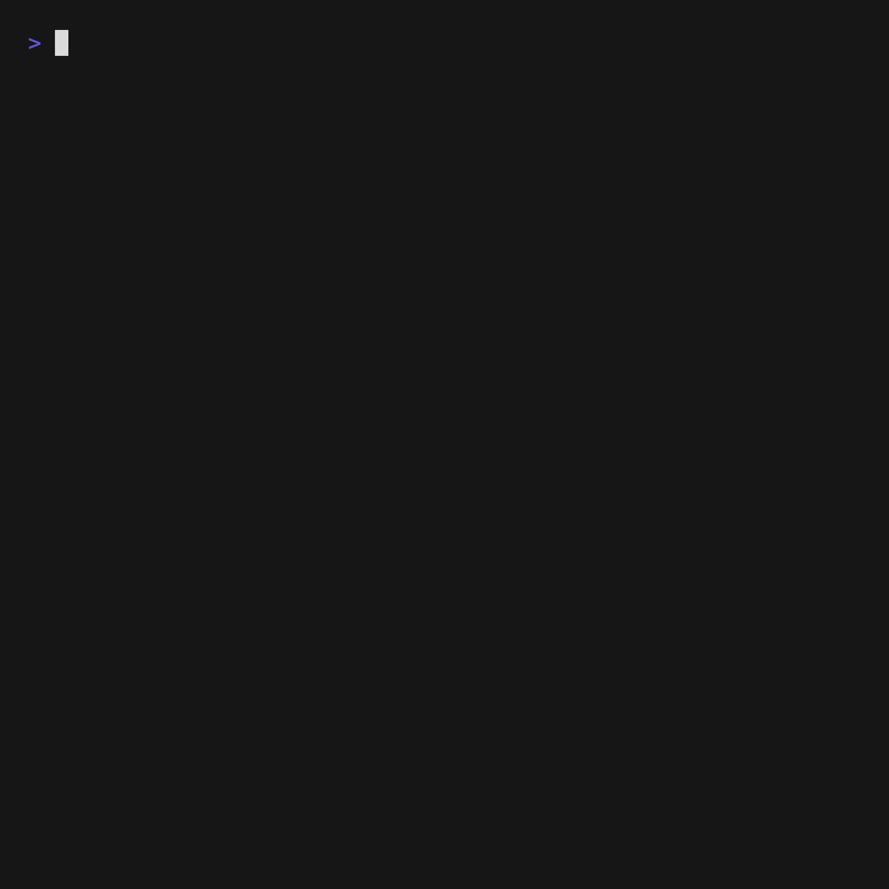
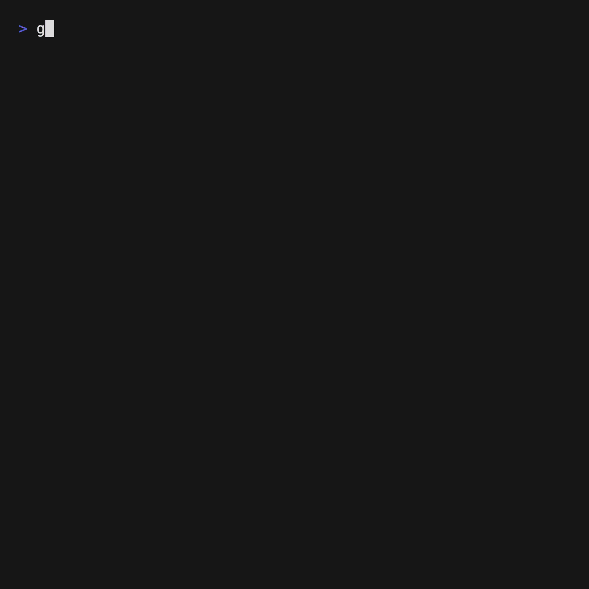

# charm-experiments

A set of experimental applications using various charm.sh libraries to see how creative a CLI application can get.

I got bored and paid for OpenAI Codex

## Harmonic Garden


`cmd/harmonic-garden` is a synesthetic terminal garden that braids [Harmonica](https://github.com/charmbracelet/harmonica) springs with [Bubble Tea](https://github.com/charmbracelet/bubbletea), [Bubbles](https://github.com/charmbracelet/bubbles), and [Lip Gloss](https://github.com/charmbracelet/lipgloss).

Muses orbit a living focal point while moody palettes wash the background with motion-triggered gradients. Pulse scenes, rose curves, and turbulent wander fields shape the choreography; shimmering "seeds" arc away from the center using Harmonica projectiles. The new "Cosmic Tie-Dye" mood splashes the screen with swirling sunbursts for full hippie glow, and a contextual key legend (powered by Bubbles `help`) keeps tools at hand while you improvise your own kinetic light painting.

### Run it

```bash
go run ./cmd/harmonic-garden
```

Use a terminal that supports the alternate screen buffer and 24-bit color for the best experience.

### Controls

- `space`: toggle auto/manual control of the focal point
- `tab`: cycle motion scenes (elliptic drift, rose bloom, cascade, pulse spiral, wander field)
- `f`: cycle follower formations (halo, ribbon, bloom, helix)
- `m`: cycle colour moods and ambient palettes (Aurora Bloom, Cosmic Tie-Dye, Solar Garden, Deep Current)
- Arrow keys / `h` `j` `k` `l`: nudge the target while in manual mode
- `;` / `'`: decrease / increase spring frequency
- `,` / `.`: decrease / increase damping
- `+` / `-`: grow or trim the follower troupe
- `?` or `/`: toggle the full help sheet (short hints stay in the footer)
- `q`: quit

### How it works

Each Muse owns paired Harmonica springs for the X and Y axes. Formation logic defines the latent offset space the springs try to inhabit, while animated scenes continually retarget the shared focal point. Trails capture recent motion and are re-coloured through Lip Gloss gradients so older motion cools while fresh motion blooms. Harmonica projectiles spawn “seeds” that burst away from the epicentre, adding secondary motion layers. Background wisps are synthesised per-frame with lightweight value-noise, staying in sync with the active mood palette.

## Vibe Studio



`cmd/vibe-studio` is a generative blend atelier that leans hard on [Bubbles](https://github.com/charmbracelet/bubbles). A curated muse list (Bubbles `list`) feeds a synesthetic log rolling through a scrollable viewport, while a spring-driven progress bar and spinner (Bubbles `progress` + `spinner`) orchestrate the infusion ritual. The contextual footer (`help`) keeps the control surface handy as you swap focus between palette and log.

### Run it

```bash
go run ./cmd/vibe-studio
```

### Controls

- `↑` / `↓`: browse the muse palette (when the list has focus)
- `tab`: toggle focus between the muse list and log viewport
- `enter`: infuse the selected muse into a fresh blend
- `s`: shuffle to a random muse
- `?` or `/`: toggle the expanded help sheet
- `q`: quit

While the viewport has focus you can use the arrow keys, `PgUp`, `PgDn`, or `g`/`G` to scroll through the blend log (courtesy of Bubbles `viewport`).

### How it works

Each infusion drives a Harmonica-spring progress bar behind the scenes while spinner ticks keep time. Completed blends are timestamped and stacked in the viewport log; selecting a muse refreshes the contextual description so the atelier stays reactive even outside the infusion ritual.

## Chroma Journal


`cmd/chroma-journal` is a lipgloss-first colour atlas that treats the terminal as a design studio. Each spread mixes rounded borders, layered shadows, soft gradients, and adaptive layouts driven entirely by [Lip Gloss](https://github.com/charmbracelet/lipgloss) composition utilities.

### Run it

```bash
go run ./cmd/chroma-journal
```

### Controls

- `←` / `→` (or `h` / `l`): cycle through themed spreads
- `space` or `g`: toggle between column and gallery grid layouts
- `r`: reshuffle the wash palette for the active spread
- `q`: quit

Gradient headings are rendered character-by-character with lipgloss styles, shadows and borders come from nested styles, and the layout automatically snaps between stacked and grid compositions using `JoinHorizontal`, `JoinVertical`, and adaptive width calculations.

## Critter Carnival



`cmd/critter-carnival` is a whimsical terminal carnival featuring animated critters that dance and play across the screen using [Bubble Tea](https://github.com/charmbracelet/bubbletea) and [Lip Gloss](https://github.com/charmbracelet/lipgloss).

### Run it

```bash
go run ./cmd/critter-carnival
```

### Controls

- `space`: start/stop the carnival
- `r`: reset all critters to starting positions
- `q`: quit

### How it works

The carnival features multiple animated critters with different movement patterns, colors, and behaviors, all rendered using terminal graphics and animations.
